# Reportes y Gráficos

## Descripcion

La funcionalidad de **Reportes y Gráficos** en Solop ERP (Tepuy Admin / Nuxt) permite visualizar indicadores clave de gestión mediante dashboards interactivos y generar reportes gráficos a partir de formatos de impresión. Los usuarios pueden monitorear el desempeño operativo y financiero en tiempo real, con gráficos de barras, líneas, burbujas y mapas de calor, además de tablas comparativas con capacidad de exportación.

Cada dashboard presenta información relevante según el **área funcional** y el **rol del usuario**, asegurando que cada perfil acceda únicamente a los indicadores que le corresponden.

## ¿Cuándo se utiliza?

Se utiliza cuando se necesita:

- Monitorear indicadores de ventas, logística, finanzas u otras áreas en tiempo real.
- Visualizar tendencias mediante gráficos interactivos con filtros por fecha.
- Generar reportes gráficos a partir de formatos de impresión existentes.
- Comparar métricas entre períodos, vendedores, categorías de producto u otras dimensiones.
- Exportar gráficos como imágenes o datos a Excel para análisis externo.

## Acceso

### Dashboards

Los dashboards se acceden desde la página de **Inicio** en Nuxt. Al ingresar al sistema, se presenta la vista principal con los dashboards disponibles según el rol del usuario.

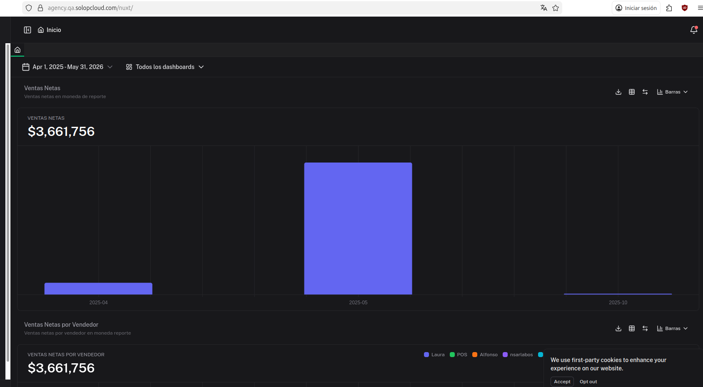

### Reportes con Gráficos

Los reportes con gráficos se acceden desde el menú lateral navegando al módulo correspondiente y seleccionando el reporte deseado.

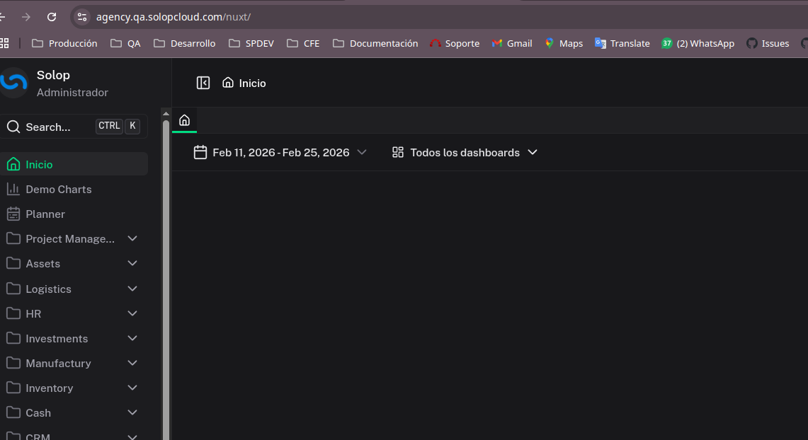

## Dashboards

### Vista general

Al ingresar a la página de Inicio, se muestran los dashboards configurados para el rol del usuario. La vista presenta múltiples paneles con gráficos, cada uno mostrando un indicador diferente.

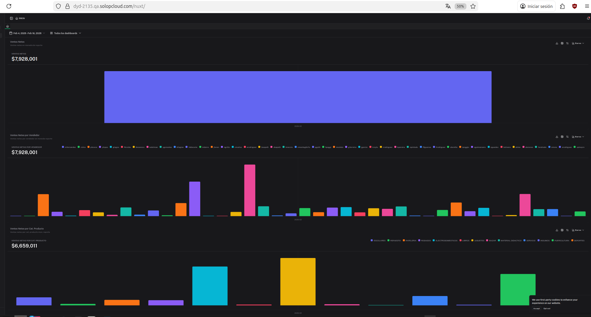

En la parte superior de la página se encuentran dos controles principales:

- **Filtro de fechas**
  Permite seleccionar el rango de fechas para filtrar los datos de todos los dashboards simultáneamente.

- **Selector de dashboards**
  Permite elegir cuáles dashboards mostrar: todos o un subconjunto específico.

### Filtro de fechas

El filtro de fechas se encuentra en la esquina superior izquierda y permite definir el período de consulta para todos los dashboards.

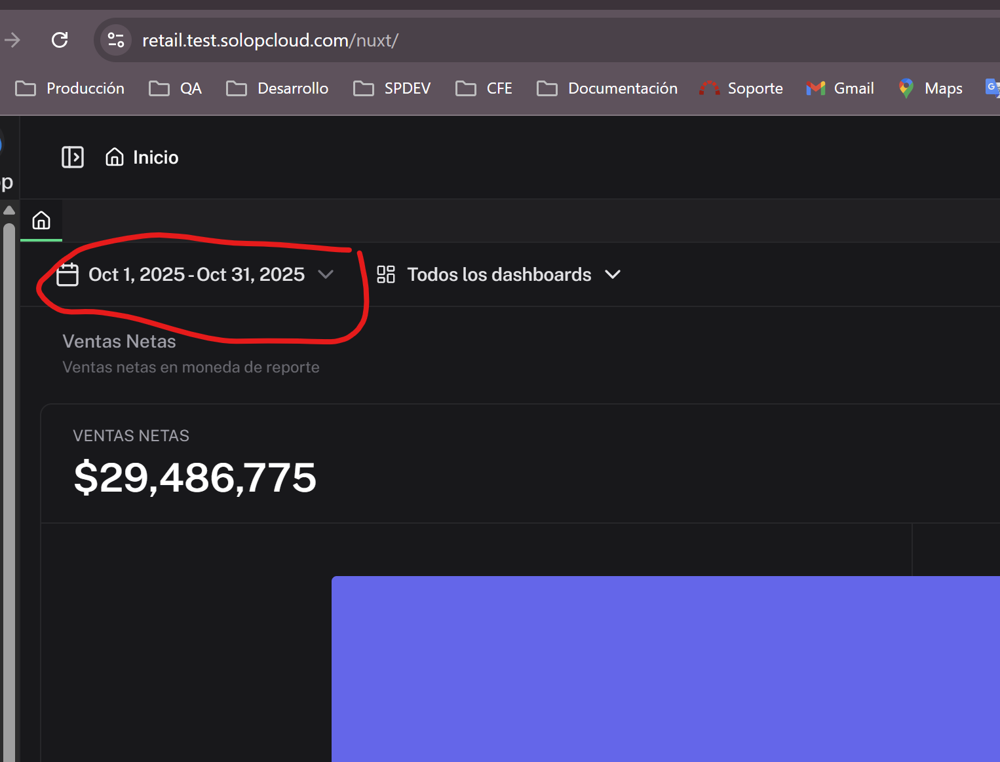

Para utilizar el filtro:

1. Haga clic en el selector de fechas.
2. Seleccione la fecha de inicio y la fecha de fin del rango deseado.
3. Los dashboards se actualizarán automáticamente con los datos del período seleccionado.

### Selector de dashboards

El selector de dashboards permite filtrar cuáles paneles se muestran en la vista de Inicio.

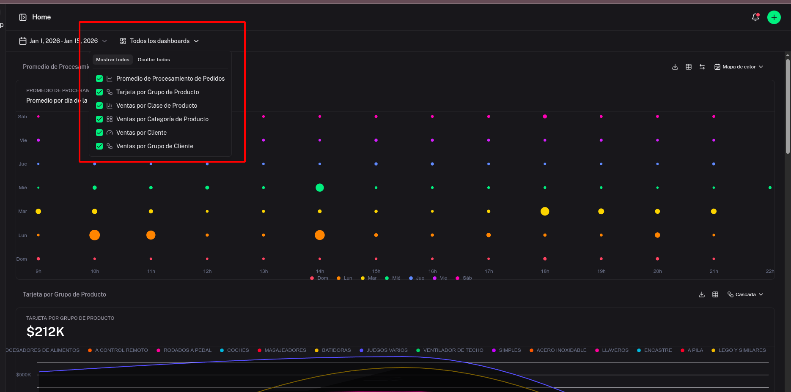

Las opciones disponibles incluyen:

- **Todos los dashboards:** muestra todos los paneles configurados para el rol.
- **Dashboards individuales:** permite seleccionar paneles específicos como Ventas Netas, Ventas por Vendedor, Ventas por Categoría de Producto, entre otros.

### Tipos de gráficos

Los dashboards soportan múltiples tipos de visualización que pueden alternarse desde la esquina superior derecha de cada panel:

- **Barras**
  Ideal para comparar valores entre categorías o períodos. Es el tipo de gráfico predeterminado para la mayoría de los dashboards.

  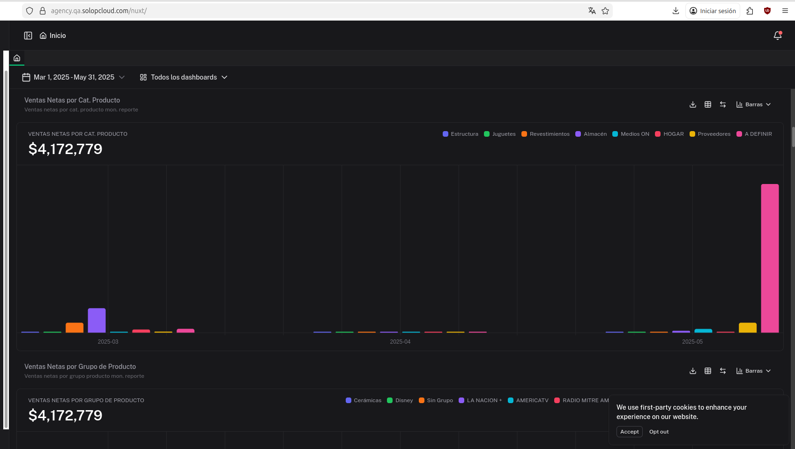

- **Líneas**
  Útil para visualizar tendencias a lo largo del tiempo.

  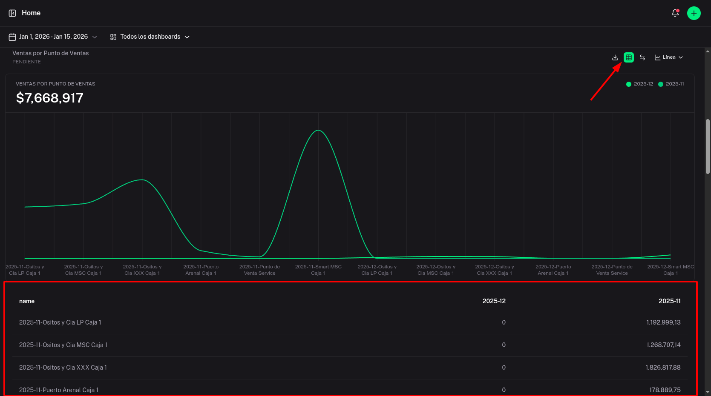

- **Burbujas**
  Permite visualizar tres dimensiones de datos simultáneamente: categoría, período y magnitud.

  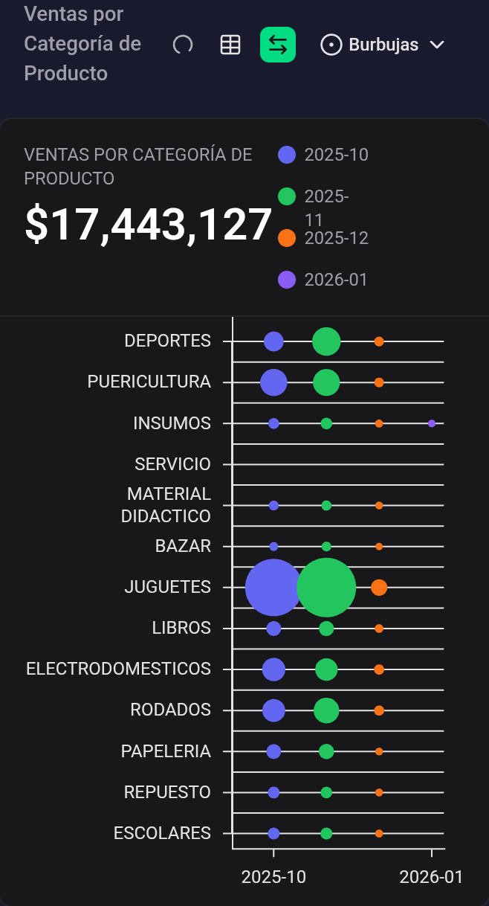

### Acciones disponibles en cada dashboard

Cada panel de dashboard cuenta con las siguientes acciones en su esquina superior derecha:

- **Descargar**
  Exporta el gráfico como imagen para uso externo.

- **Vista de tabla**
  Alterna entre la vista gráfica y una tabla con los datos detallados.

- **Pantalla completa**
  Expande el dashboard para ocupar toda la pantalla.

- **Selector de tipo de gráfico**
  Permite cambiar entre Barras, Líneas u otros tipos disponibles.

### Dashboards por área funcional

Los dashboards se organizan según el área funcional del negocio. Para ver el detalle completo de cada dashboard, consulte la [documentación de Dashboards](/dashboards/).

| Área | Dashboards principales |
|------|----------------------|
| Ventas | Ventas Netas, Ventas por Vendedor, Ventas por Categoría de Producto, Ventas por Cliente, Venta Diaria |
| Logística e Inventario | Entregas, Recepciones, Días de Stock, Rotación de Inventario |
| Compras | Órdenes de Compra, Recepciones pendientes |
| Finanzas | Cuentas por Cobrar, Cuentas por Pagar, Flujo de Caja |
| Manufactura | Órdenes de Producción |
| Recursos Humanos | Indicadores de nómina |

## Reportes con formato de impresión

### Vista general

Los reportes con formato de impresión permiten ejecutar consultas parametrizadas y visualizar los resultados en formato tabular con opción de gráficos.

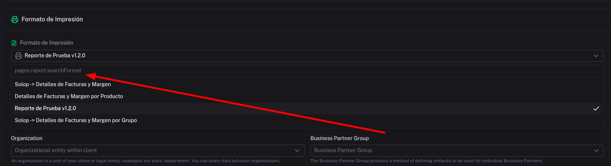

### Campos principales

- **Formato de Impresión**
  Selecciona el formato que define las columnas y el diseño del reporte. Los formatos disponibles dependen del tipo de reporte.

- **Organización**
  Filtra los datos por la organización seleccionada.

- **Grupo de Socio del Negocio**
  Permite filtrar por grupo de socios del negocio.

- **Parámetros adicionales**
  Según el reporte seleccionado, pueden estar disponibles filtros adicionales como vendedor, categoría de producto, región de ventas, entre otros.

### Visualización de resultados

Los resultados del reporte se presentan en formato tabular con las columnas definidas en el formato de impresión.

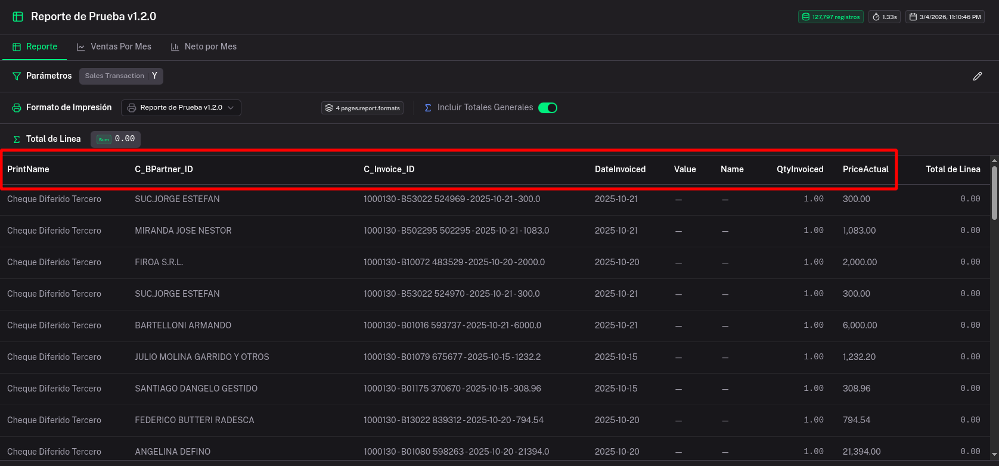

El reporte ofrece múltiples vistas organizadas en pestañas:

- **Reporte:** vista principal con los datos tabulares.
- **Ventas Por Mes:** vista agrupada por período mensual.
- **Metas por Mes:** comparación contra metas definidas.

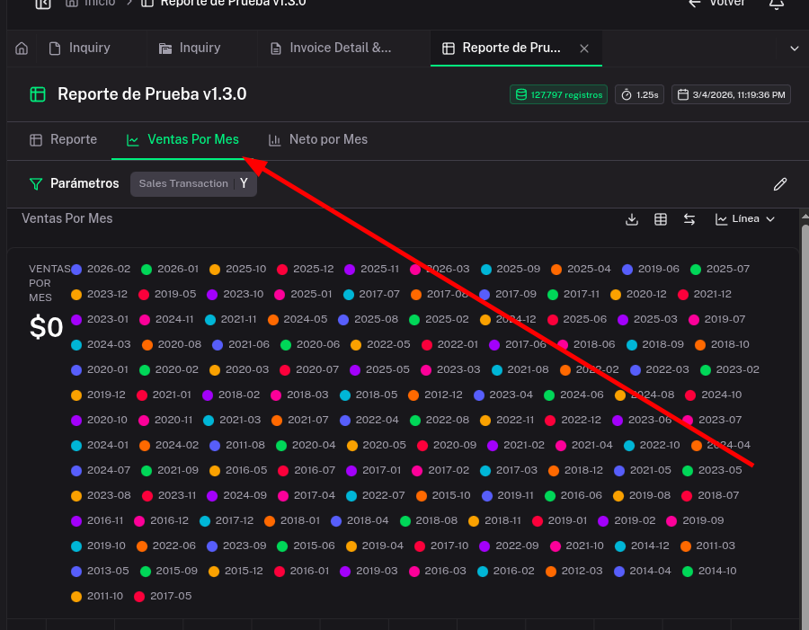

### Gráficos en reportes

Para agregar gráficos a un reporte basado en formato de impresión, se debe configurar el **Gráfico de Formulario** desde el backend:

1. Acceder a la ventana **Gráfico de Formulario** en el diccionario de aplicación.
2. Asignar el formato de impresión correspondiente (por ejemplo, "Resumen Factura 1").
3. Definir el nombre del gráfico y seleccionar el tipo de gráfico deseado.
4. Agregar los elementos del gráfico: seleccionar la **categoría** (eje de agrupación) y la **medida** (valor a graficar).
5. Configurar la agrupación temporal si corresponde (por semanas, meses, etc.).
6. Guardar los cambios.

Al ejecutar el reporte con el formato de impresión configurado, el gráfico se mostrará junto con los datos tabulares.

## Configuración de dashboards

### Objetivos de Desempeño

Los dashboards se configuran a través de la ventana **Objetivo de Desempeño** (`PA_Goal`) en el backend del sistema. Cada registro de esta ventana define un dashboard con su consulta SQL, tipo de gráfico y rol asignado.

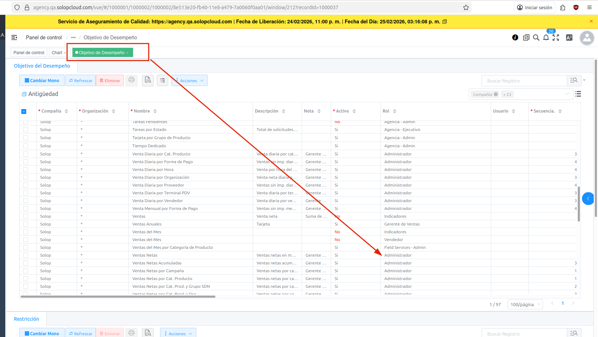

### Asignación de roles

Cada dashboard se asigna a un rol específico que determina qué usuarios pueden visualizarlo. Los roles principales y la cantidad de dashboards asociados son:

| Rol | Cantidad de dashboards |
|-----|----------------------:|
| Gerente de Ventas | 128 |
| Gerente de Logística | 35 |
| Finanzas | 27 |
| Gerente Compras | 24 |
| Gerente de AR | 22 |
| Operativos | 20 |
| Gerente de AP | 15 |
| Tesorería / Bancos | 13 |
| Gerente Financiero | 12 |
| Tiempo y Facturación | 9 |
| Gerente Producción | 8 |
| Project Manager | 8 |
| Gastos | 8 |
| CRM | 6 |
| Operación | 4 |
| Recursos Humanos | 3 |
| Gerente Almacén | 1 |

### Moneda de reporte

Los dashboards muestran los montos convertidos a la **Moneda de Reporte** configurada en la información de la Organización (`AD_OrgInfo`). Esta configuración es obligatoria para que los dashboards puedan mostrar datos correctamente.

Para configurar la moneda de reporte:

1. Acceder a la ventana **Organización** en el backend.
2. En la pestaña **Información de Organización**, localizar el campo **Moneda para Reportes**.
3. Seleccionar la moneda deseada (por ejemplo, UYU, USD, ARS).
4. Guardar los cambios.

## Consideraciones importantes

- Siempre debe existir una **moneda de reporte** configurada en la información de la organización para que los dashboards muestren datos.
- Los dashboards se muestran según el **rol del usuario** activo. Si no se visualizan dashboards, verificar que el rol tenga dashboards asignados en la ventana de Objetivo de Desempeño.
- El **filtro de fechas** afecta a todos los dashboards de la página simultáneamente.
- Al configurar gráficos en reportes, es necesario definir siempre al menos una **medida** y una **categoría** antes de ejecutar.
- La cantidad de conexiones a la base de datos puede afectar el rendimiento de los dashboards. Si se experimenta lentitud, verificar la configuración del pool de conexiones (HikariCP) en el tenant.
- Los dashboards se cargan dinámicamente y pueden requerir unos segundos para mostrar los datos, especialmente con rangos de fechas amplios.

## Ejemplo de uso

### Consultar ventas netas del mes

1. Ingresar a Solop ERP desde Nuxt.
2. En la página de **Inicio**, se mostrarán los dashboards disponibles.
3. Ajustar el **filtro de fechas** al mes que se desea consultar.
4. El dashboard de **Ventas Netas** mostrará el total acumulado y el gráfico de barras con el desglose.
5. Para ver el detalle por vendedor, desplazarse al dashboard de **Ventas Netas por Vendedor**.
6. Utilizar el selector de tipo de gráfico para alternar entre barras, líneas o burbujas según la necesidad de análisis.
7. Para exportar, hacer clic en el botón de descarga en la esquina superior derecha del dashboard.
